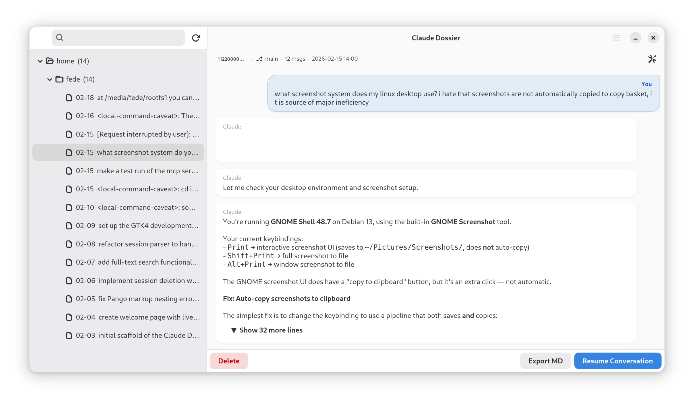

# Claude Dossier

A native GTK4 / Adwaita desktop app for browsing, searching, and resuming your [Claude Code](https://claude.ai/code) session history.



## About

Claude Dossier reads the session history written by Claude Code into `~/.claude/projects/` and presents it as a clean, searchable sidebar of projects and conversations. Click a session to read the full transcript, search across all content with full-text indexing, resume a session directly from the app, or view and edit the `CLAUDE.md` configuration files that guide Claude's behaviour in each project.

**Features**

- Sidebar tree of projects grouped by directory, sorted by recent activity
- Full conversation viewer with markdown rendering
- Full-text search (SQLite FTS5) across all session content, built incrementally in the background
- Hover-preview with auto-restore to the last committed selection
- Resume any session in a terminal with one click (`claude --resume <id>`)
- Export conversations to Markdown
- View and edit the `CLAUDE.md` inheritance chain for each project
- Keyboard-friendly, no Electron

## Running from source

```bash
git clone https://github.com/Fede654/ClaudeDossier.git
cd ClaudeDossier
python3 -m venv .venv --system-site-packages
source .venv/bin/activate
pip install pytest
./run-dev.sh
```

**Dependencies** (system packages on Debian/Ubuntu):

```
python3-gi gir1.2-gtk-4.0 gir1.2-adw-1 gir1.2-glib-2.0
```

## Running tests

```bash
source .venv/bin/activate
GSETTINGS_BACKEND=memory pytest tests/ -v
```

## Forked from

[Apostrophe](https://gitlab.gnome.org/World/apostrophe) — a GTK4 Markdown editor by Wolf Vollprecht and Manuel Genovés. The GTK4 / Adwaita application shell, build system, and resource pipeline were reused; all editor functionality has been replaced.
