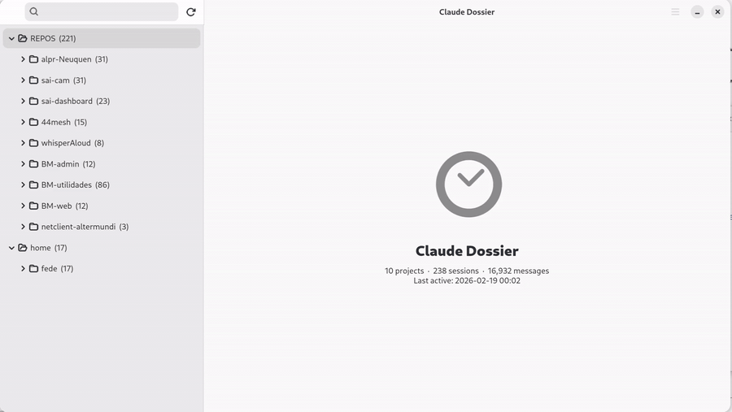

# Claude Dossier

A native GTK4 / Adwaita desktop app for browsing, searching, and resuming your [Claude Code](https://claude.ai/code) session history.



## About

Claude Dossier reads the session history written by Claude Code into `~/.claude/projects/` and presents it as a clean, searchable sidebar of projects and conversations. Click a session to read the full transcript, search across all content with full-text indexing, resume a session directly from the app, or view and edit the `CLAUDE.md` configuration files that guide Claude's behaviour in each project.

**Features**

- Sidebar tree of projects grouped by directory, sorted by recent activity
- Full conversation viewer with markdown rendering
- Full-text search (SQLite FTS5) across all session content, built incrementally in the background
- Hover-preview with auto-restore to the last committed selection
- Resume any session in a terminal with one click (`claude --resume <id>`)
- Export conversations to Markdown
- View and edit the `CLAUDE.md` inheritance chain for each project
- Keyboard-friendly, no Electron

## Developer Documentation

See [docs/DATA_FORMATS.md](docs/DATA_FORMATS.md) for detailed schema documentation,
known bugs, and data preservation guidance for each supported format.

## Requirements

- Python 3.10+
- GTK 4 and libadwaita 1.4+ (system libraries)
- PyGObject — the Python GTK bindings (`python3-gi`)

PyGObject must come from your system package manager, not pip.

| Distro | Command |
|--------|---------|
| Debian / Ubuntu | `sudo apt install python3-gi gir1.2-gtk-4.0 gir1.2-adw-1` |
| Fedora | `sudo dnf install python3-gobject gtk4 libadwaita` |
| Arch | `sudo pacman -S python-gobject gtk4 libadwaita` |
| macOS (Homebrew) | `brew install pygobject3 gtk4 libadwaita` |

## Running from source

```bash
git clone https://github.com/Fede654/ClaudeDossier.git
cd ClaudeDossier
python3 -m venv .venv --system-site-packages  # gives the venv access to system GTK bindings
source .venv/bin/activate
./run-dev.sh
```

## Building and installing

Requires `meson` and `ninja`:

```bash
# Debian / Ubuntu
sudo apt install meson ninja-build
# Fedora
sudo dnf install meson ninja-build
# Arch
sudo pacman -S meson ninja
```

Then build and install system-wide:

```bash
meson setup builddir --prefix=/usr/local
meson compile -C builddir
sudo meson install -C builddir
```

The `dossier` command will be available on your PATH and the app will appear in your application grid.

To uninstall:

```bash
sudo ninja -C builddir uninstall
```

## Running tests

```bash
source .venv/bin/activate
pip install pytest
GSETTINGS_BACKEND=memory pytest tests/ -v
```

## Forked from

[Apostrophe](https://gitlab.gnome.org/World/apostrophe) — a GTK4 Markdown editor by Wolf Vollprecht and Manuel Genovés. The GTK4 / Adwaita application shell, build system, and resource pipeline were reused; all editor functionality has been replaced.
